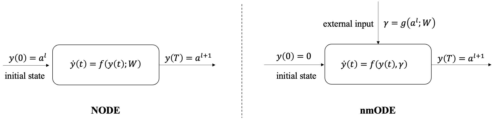

## Jittor-NODE

**Jittor-NODE** is a lightweight [Jittor](https://cg.cs.tsinghua.edu.cn/jittor/)-based ODE (Ordinary Differential Equation) Solver library that mainly motivated by the [torchdiffeq](https://github.com/rtqichen/torchdiffeq). Jittor-NODE aims to offer clear and educational implementations of Neural ODEs by using Jittor for research and study purposes. Currently, it supports the **Euler** and **RK4** two fixed grid ODE Solvers.

### Installation

To install the library locally:

```bash
git clone https://github.com/SCU-JittorMed/Jittor-NODE.git
cd Jittor-NODE
pip install -e .
```

### Usage of Jittor-NODE

```python
from jittornode import odeint

y_T = odeint(module, y_0, jt.linspace(0.0, 1.0, 10), method='rk4')
```

Explanation:

- **`module`**: A `nn.Module` defined using Jittor, representing the ODE function $f(t,y)$. This module typically encapsulates a neural network module such as fully-connected or convolutional layer.
- **`y_0`**: The initial state $y(0)$ of the system. In Neural ODEs, this is usually the output from the previous layer.
- **`jt.linspace(0.0, 1.0, 10)`**: A sequence of time points over which to integrate, from 0.0 to 1.0 with 10 steps.
- **`method`**: Specifies the ODE solver to use. Supported methods: `'rk4'` (Runge–Kutta 4th order) and `'euler'` (Euler method).
- **`y_T`**: The solution $y(T)$ provided by the ODE solver.

### Comparison between NODE and nmODE

**nmODE** (neural memory ODE) is a specialized variant of Neural ODE that explicitly separates the initial state from the external input. This distinction provides greater flexibility in modeling dynamic systems.

The conceptual difference between standard NODE and nmODE is illustrated in the figure below:

<p align="center">
  
</p>

Notably, **nmODE** can serve as a general framework. A specific form of this framework was proposed by [Professor Zhang Yi](http://www.machineilab.org/users/zhangyi/index.html), defined by the following ordinary differential equation:

$$
\dot{y}(t) = -y(t) + \sin^{2} \left( y(t)+\gamma \right).
$$

### Examples

We provide three usage examples in Jupyter Notebooks under the `examples/` folder:

- **Example 1**: Comparison between the solutions obtained using `jittornode` and SciPy’s ODE solver.
- **Example 2**: Implementation of a Neural ODE (NODE) combined with a CNN for the MNIST classification task, inspired by [Chen et al.'s paper](https://arxiv.org/abs/1806.07366).
- **Example 3**: Implementation of an nmODE combined with a CNN for the MNIST classification task, based on the model proposed in [Zhang Yi’s paper](https://link.springer.com/article/10.1007/s10462-023-10496-2).

### Citation

```bibtex
@article{hu2020jittor,
  title={Jittor: a novel deep learning framework with meta-operators and unified graph execution},
  author={Hu, Shi-Min and Liang, Dun and Yang, Guo-Ye and Yang, Guo-Wei and Zhou, Wen-Yang},
  journal={Science China Information Sciences},
  volume={63},
  number={222103},
  pages={1--21},
  year={2020}
}

@article{yi2023nmode,
  title={nmODE: neural memory ordinary differential equation},
  author={Yi, Zhang},
  journal={Artificial Intelligence Review},
  volume={56},
  number={12},
  pages={14403--14438},
  year={2023},
  publisher={Springer}
}

@article{niu2024applications,
  title={On the applications of neural ordinary differential equations in medical image analysis},
  author={Niu, Hao and Zhou, Yuxiang and Yan, Xiaohao and Wu, Jun and Shen, Yuncheng and Yi, Zhang and Hu, Junjie},
  journal={Artificial Intelligence Review},
  volume={57},
  number={9},
  pages={236},
  year={2024},
  publisher={Springer}
}
```